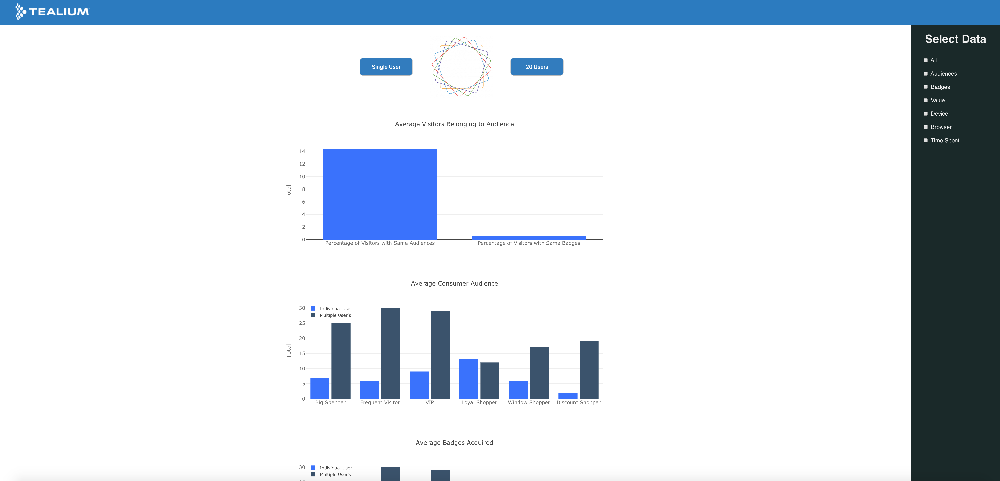
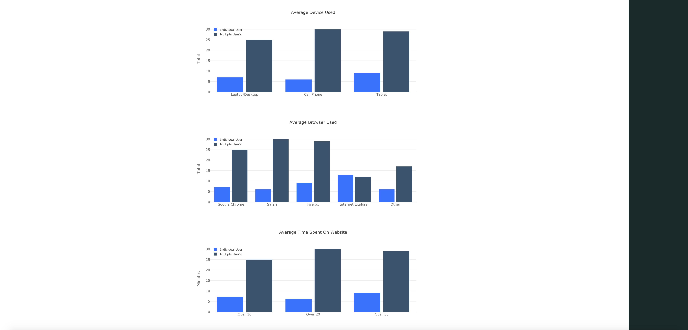

# Tealium-Hackathon-July 2018-The Total Machine 
# by ***-The Average Joes***




At the 2018 Tealium Hackathon event, our team built a data statistic 
display tool to give Tealium an added service for their clients, 
supplying them a way to achieve coordinated marketing strategies 
through a simple information viewing system. As a result of our 
quality interface, overall presentation, and camaraderie, we finished 
in the top 3 finalists. My responsibilities were designing the user 
interface and presenting our project to a panel judges.

## Please feel free to demo the project by taking these steps..
```
Clone or fork the repo
```
```
npm install
```
```
npm start
```
```
Open your browser to view on localhost: 3000
```
* **Thank you**, ***-Miles Mickelson***
